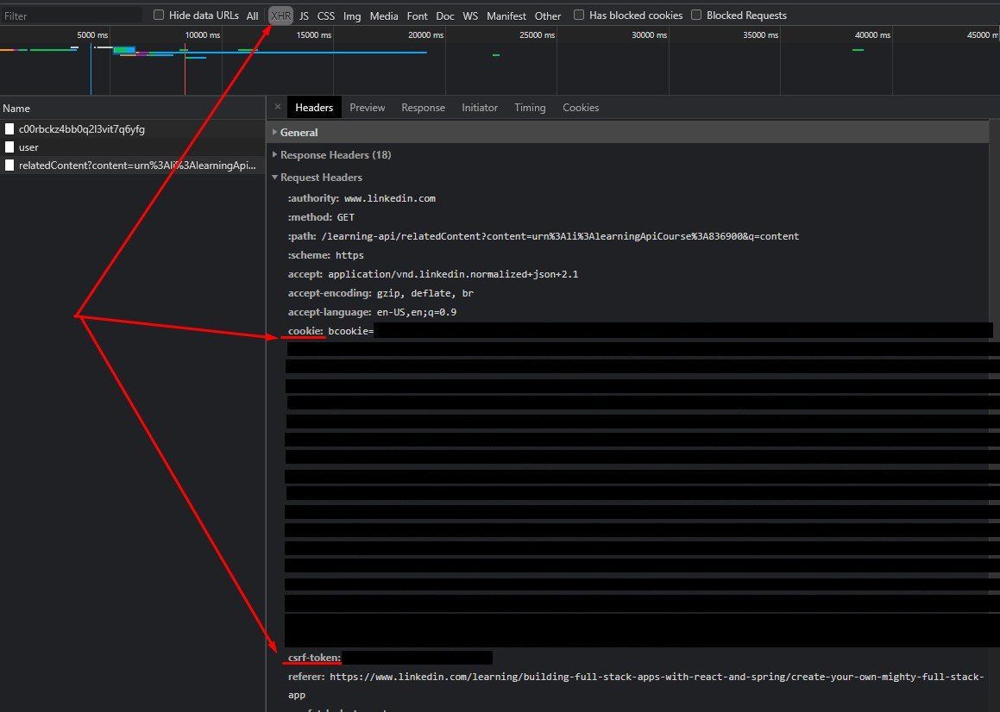

# Linkedin video scraper

That's a wip for downloading videos from https://www.linkedin.com/learning courses. Use at your own risk (:

Download [compiled version](https://github.com/Bwca/linkedin-learning-downloader/blob/master/dist/linkedin-learning-downloader.js) and run it:

`node ./linkedin-learning-downloader.js`

Or run it from source by cloning the repo:

`git clone https://github.com/Bwca/linkedin-learning-downloader.git`
`cd linkedin-learning-downloader`

Install dependencies:

`npm i`

Run it from source:

`npm run start`

Build it from source:

`npm run build`

As of yet, requires entering csrf-token and cookie from current session for authorisation.

## Obtaining the csrf-token and the cookie

Open dev tools and navigate to a page from the course you want to download and on the XHR tab find a request that has `cookie` and `csrf-token`, these are the ones you need to paste to download videos:



## Storing the csrf-token and the cookie

If you plan to download multiple courses, it might be inconvenient to copy-paste the tokens all the time, so there is a way to save them.

You can save the cookie as `./dist/cookie.token` and csrf-token as `./dist/csrf.token` if you run the app as `node dist`. If you choose to do so, note that these tokens will become invalid as soon as you log off on Linkedin.

### Example csrf.token and cookie.token files

csrf.token

```txt
ajax:0000000000000000000
```

```txt
bcookie="reallyLongStringWithWeirdCharactersAllInSingleLine....
```